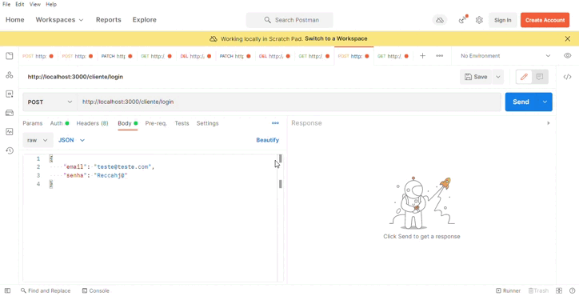

<p align="center">

</p>

## Descrição:

<p>A presente aplicação é uma funcionalidade back-end que gera e administra, de forma mais fácil, o cadastro de clientes com foco em entrega de produtos de resturante(delivery), entretanto, a aplicação foi criada de forma de possa ser utilizada, e adaptada, para cadastro de clientes de qualquer serviço oferecido. Para o programa, o banco de dados relacionais SQLite foi usado, assim como os verbos HTTP e o padrão REST, além da arquitetura MVC, de forma a estruturar coerentemente as operações do método CRUD. Além disso, a API conta com autenticação de login por tokens, utilizando a lib jsonwebtoken e outras dependências para estratégias de autenticação local e bearer.

Considerando a forma como a lógica de autenticação por tokens foi implementada, utilizando redis para desenvolvimento local, pelo menos por enquanto, para que a API rode localmente de forma impecável, é preciso ter o redis rodando em sua máquina.

Instruções de instaLAção disponível em:
[redis.io](https://redis.io/docs/getting-started/installation/install-redis-on-linux/)

Caso o sistema operacional seja Windows, recomendo fortemente e leitura do blog para tal: [redis.com](https://redis.com/blog/redis-on-windows-10/)

Este projeto faz parte do Trabalho Final da conclusão do Módulo 4 do curso de Dev. Web FullStack da <a href="https://www.resilia.com.br">Resilia Educação.</a></p>

## Status do Projeto


## Ferramentas necessárias:

<p>Atenção nesta parte, pois para utilizar esta Api você precisará instalar algumas ferramentas fundamentais na sua máquina, como: <a href="https://www.gitkraken.com/download?utm_term=git&utm_campaign=1+%7C+1+GK+Git+GUI+-+Search&utm_source=adwords&utm_medium=ppc&hsa_acc=1130375851&hsa_cam=393455543&hsa_grp=23981425823&hsa_ad=550570964612&hsa_src=g&hsa_tgt=kwd-247385313&hsa_kw=git&hsa_mt=e&hsa_net=adwords&hsa_ver=3&gclid=Cj0KCQiA-qGNBhD3ARIsAO_o7ym_H2X6ZGqwCZJqFF5FFzq4fVkZ1h6JujQY4yk9UI5bf2cnWf-Ez-EaAstwEALw_wcB">Git</a> e o JavaScript com <a href="https://nodejs.org/en/download/">NodeJS</a>, além do gerenciador de pacotes npm e a framework express. 
<strong>Observação</strong> é recomendável a utilização de um editor de código que tenha familiaridade, caso não tenha com nenhum, recomenda-se o <a href="https://code.visualstudio.com/download">VsCode</a> pela intuitividade do mecanismo.

## Algumas variáveis de dependência que precisam ser declaradas para o funcionamento adequado do projeto:

## Chave para o Json Web Tokemn

### CHAVE_JWT
 
## Conexão com o Redis
### REDIS_URL
### REDIS_PASSOWORD
 
# Dependências:

<br>
<br>
<br>
<br>
<br>
<br>
<br>
<br>
<br>
<br>

# Dependências de desenvolvimento:


</p>

## Iniciando passo a passo:

<p>

<ul> 
<li>Após a instalação das ferramentas, acesse o local em sua máquina onde deseja clonar o repositório, abra o terminal "Git Bash"
e rode o seguinte comando no terminal:</li>
<li> git clone https://github.com/LuthGom/restaurante-cliente-API.git </li>
<li>Com o repositório aberto, instale as dependências necessárias com o seguinte comando no terminal:</li>
<li> npm install </li>
<li>Para instalar as dependências de desenvolvimento, rode o comando abaixo no terminal:</li>
<li> npm install nodemon --save-dev</li>
<li>Para iniciar a aplicação basta rodar o comando abaixo via terminal:</li>
<li> npm start</li>
<li> O servidor iniciará na porta:3000 - acesse: http://localhost:3000/clientes</li>

## Atenção:

<p>
<ol>
 <li>É essencial salientar que a versão do NodeJs utilizada para desenvolvimento é a v16.13.0 x LTS, ou seja, é pertinente a instalação de versão igual ou superior para a impecável execução da mesma.</li>

 <li>Caso você por algum motivo venha a excluir o arquivo "database.db", que é o nosso banco de dados gerado com a ferramenta SQLite, rode o comando abaixo a fim de gerar outro banco de dados:</li>
 <li>$ node ./src/infr/create-db.js</li>
 </ol>
</p>

## Rotas da API:

| Método     | Rota              | Descrição                                 |
| ---------- | ----------------- | ----------------------------------------- |
| **GET**    | `/clientes`       | Lista todas os clientes                   |
| **GET**    | `/cliente/:id`    | Busca o cliente pelo {id}                 |
| **GET**    | `/cliente/logout` | Realiza logout do cliente                 |
| **POST**   | `/cliente`        | Cadastra um novo cliente                  |
| **POST**   | `/cliente/login`  | Autenticação de login do cliente          |
| **PATCH**  | `/cliente/:id`    | Atualiza o cadastro do cliente pelo {cpf} |
| **DELETE** | `/cliete/:cpf`    | Deleta o cadastro do cliente pelo {cpf}   |

</p>

### CAMPOS NECESSÁRIOS PARA CADASTRO DE UM CLIENTE:

#### OBS: os campos CPF, nome, telefone e senha possuem validações. Confira abaixo.
#### Utiliza o body de exemplo abaixo para teste, se desejar.

```json
{
  "cpf": "01743489080",
  "nome": "José do Teste",
  "telefone": 12345678911,
  "cep": 13245678,
  "endereco": "Rua do Teste, 390, QD-B",
  "cidade": "TesteCity",
  "uf": "ET",
  "email": "teste@email.com",
  "senha": "Teste@te"
}
```

#### CPF: algoritmo de validação da receita federal. Recomenda-se o site [Gerador de CPFs - 4Devs](https://www.4devs.com.br/gerador_de_cpf) para utilizar um cpf que atinga da validação.

#### Nome: Pelo menos 8 caracteres.

#### Email: formato: exemplo@email.com

#### Senha: Pelo menos 1 letra maiúscula, pelo menos 1 minúscula e pelo menos 1 caracter especial. No mínimo 8 caracteres.

### COMO REALIZAR O LOGIN:

```json
{
  "email": "email cdastrado",
  "senha": "senha cadastrada"
}
```

### o login gerará um token, que vai ser requisitado para realizar outras ações, como logout, delete e ações futuras relaciodas a outras entidades que podem ser adicionadas e relacionadas ao cliente.

### COMO PEGAR E UTILIZAR O TOKEN GERADO PELO LOGIN:



### COMO ATUALIZAR UM CLIENTE:

```json
{
    exemplo:
    "email": "novo email"
}
```

## Autor 🌈


<a href="https://www.linkedin.com/in/dev-luciano-mendes/">Luciano Mendes(Luth🌈) | Clique aqui para o meu Linkedin<a/>

<p>Um ex quase professor de Química!
Depois de 3 anos cursando a Licenciatura, abandonei a graduação antes que entrasse em moldes sociais rígidos
e perdesse o viés educacional presente em mim!</p>
